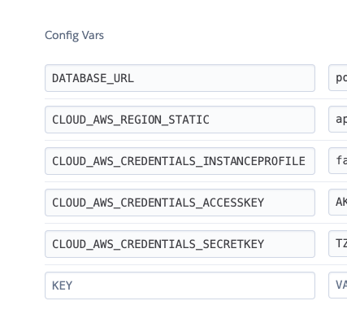

# Spring1-2020 recap observability

## Running Locally

- credentials require CloudWatch full accesses for now
 
```shell
$ docker-compose up -d

$ ./mvnw spring-boot:run -Dspring-boot.run.jvmArguments=" \
-Dcloud.aws.region.static=ap-northeast-1 \
-Dcloud.aws.credentials.instanceProfile=false \
-Dcloud.aws.credentials.accessKey=ABCDEFGHIJKLMNOPQRST \
-Dcloud.aws.credentials.secretKey=ABCDEFg123456789+abcdefghij12345ABCDEFGH"
```

## Build

```shell
$ ./mvnw clean package
```

## Deploy to Heroku

```shell
$ heroku login

### heroku create (Applicationの作製)
$ heroku create spring1-2020-recap
 
### Database Configuration（data baseを追加）
$ heroku addons:create heroku-postgresql:hobby-dev

$ git push heroku master
```

※Set AWS Credentials to environment variable in order to connect CloudWatch
